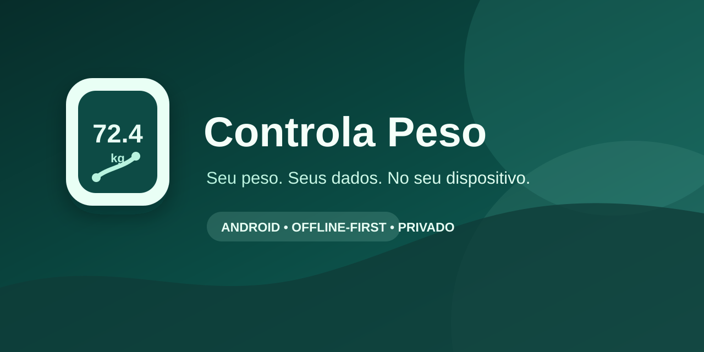

<p align="center">
  
</p>

<h1 align="center">Controla Peso</h1>

<p align="center">
  
</p>

<p align="center">
  Acompanhamento de peso local, privado e offline-first para Android.
</p>

<p align="center">
  <a href="https://github.com/guiloklex-hub/ControlaPeso/actions/workflows/ci.yml"></a>
  <a href="https://github.com/guiloklex-hub/ControlaPeso/releases"></a>
  <a href="LICENSE"></a>
  <a href="https://github.com/guiloklex-hub/ControlaPeso/issues"></a>
</p>

> O Controla Peso não é um dispositivo médico. Ele registra peso e apresenta
> tendências neutras; métricas não confirmadas pelo protocolo permanecem ausentes.

## Por que existe

Controla Peso é uma alternativa Android nativa para registrar peso sem conta,
Internet, anúncios, analytics, telemetria ou servidor. Ele recebe anúncios BLE
observados em balanças compatíveis com o fluxo do OKOK International e também
permite registros manuais.

Os dados permanecem no dispositivo. Exportação, relatório, backup e Health
Connect só ocorrem após uma ação explícita da pessoa usuária.

## Recursos

- Leitura BLE por advertising, sem conexão GATT especulativa.
- Parser defensivo, payload bruto preservado e diagnóstico técnico opcional.
- Histórico local Room, múltiplos perfis, metas, gráficos e tendências.
- Registro manual com máscara de data brasileira `DD-MM-AAAA`.
- Relatórios PDF/CSV, backup JSON, Sharesheet e SAF.
- Health Connect opcional e somente para escrita de peso.
- Tema claro, escuro, sistema, cores dinâmicas e efeitos visuais reduzidos.
- Layout adaptável para celulares, tablets, dobra, paisagem e tela dividida.

## Instalação

Baixe os artefatos no [último release](https://github.com/guiloklex-hub/ControlaPeso/releases/latest).

| Artefato | Indicado para |
|---|---|
| `ControlaPeso-vX.Y.Z-universal.apk` | Opção mais simples; inclui ARM e x86. |
| `ControlaPeso-vX.Y.Z-arm64-v8a.apk` | Quase todos os celulares Android atuais. |
| `ControlaPeso-vX.Y.Z-armeabi-v7a.apk` | Celulares Android mais antigos de 32 bits. |
| `ControlaPeso-vX.Y.Z-x86_64.apk` | Emuladores e alguns dispositivos ChromeOS. |
| `ControlaPeso-vX.Y.Z-x86.apk` | Emuladores legados. |
| `ControlaPeso-vX.Y.Z.aab` | Publicação em lojas compatíveis com Android App Bundle. |

O app exige Android 7.0 / API 24 ou superior. Verifique `SHA256SUMS.txt` antes
de instalar um APK. Consulte [Distribuição](docs/DISTRIBUTION.md) para detalhes
de compatibilidade e assinatura.

## Uso rápido com a balança

1. Feche completamente o OKOK International.
2. Ative Bluetooth e conceda as permissões necessárias.
3. Em **Medir**, escolha **Medir com a balança** e inicie a busca.
4. Suba na balança e espere a leitura ficar estável.
5. Compare valor e unidade com o visor físico antes de salvar.

O scanner não filtra nome ou UUID na descoberta. Dispositivos não reconhecidos
continuam visíveis para diagnóstico, mas o app não conecta nem escreve em uma
balança automaticamente.

## Desenvolvimento

Pré-requisitos: JDK 21, Android SDK 36.1 e Android Studio compatível com AGP
9.3.1. As versões de Gradle, AGP, Kotlin e Compose são deliberadamente
preservadas; consulte [Dependências](docs/DEPENDENCIES.md).

```bash
./gradlew test
./gradlew lint
./gradlew assembleDebug
./gradlew assembleRelease
```

Com um telefone ou emulador autorizado:

```bash
./gradlew connectedAndroidTest
```

O APK debug fica em `app/build/outputs/apk/debug/`. Para instalar:

```bash
adb install -r app/build/outputs/apk/debug/app-universal-debug.apk
```

## Arquitetura e privacidade

```text
Compose UI → ViewModels/StateFlow → casos de uso → repositories
                                           ├── Room / DataStore / exportação
                                           └── BLE scanner → parser → detector de estabilidade
```

O scanner BLE e os parsers não dependem de Composables. O app não declara a
permissão `INTERNET`; não há backend nem SDK proprietário.

- [Arquitetura](docs/ARCHITECTURE.md)
- [Protocolo e evidências BLE](docs/BLE_PROTOCOL_AND_CONNECTION.md)
- [Privacidade](docs/PRIVACY.md)
- [Diagnóstico BLE](docs/BLE_DIAGNOSTIC.md)
- [Testes](docs/TESTING.md)
- [Distribuição e releases](docs/DISTRIBUTION.md)

## Estado e limitações

O formato C0 foi validado apenas com a balança Yoda1 observada. O app não
infere composição corporal, unidade ou estabilidade sem evidência física. Antes
de mudar o parser ou os limites, siga a [validação física BLE](docs/BLE_PHYSICAL_VALIDATION.md).

O Health Connect exige API 26, mas as demais funções permanecem disponíveis em
API 24–25. Testes de balança, compartilhamento, notificações, Health Connect e
TalkBack dependem de telefone físico.

## Comunidade

Contribuições são bem-vindas, especialmente testes de compatibilidade e
capturas BLE com consentimento e dados minimizados.

- [Como contribuir](CONTRIBUTING.md)
- [Código de conduta](CODE_OF_CONDUCT.md)
- [Política de segurança](SECURITY.md)
- [Changelog](CHANGELOG.md)
- [Documentação completa](docs/README.md)

## Licença

Distribuído sob a [Apache License 2.0](LICENSE). Ao contribuir, você concorda
que sua contribuição poderá ser distribuída sob essa mesma licença.
